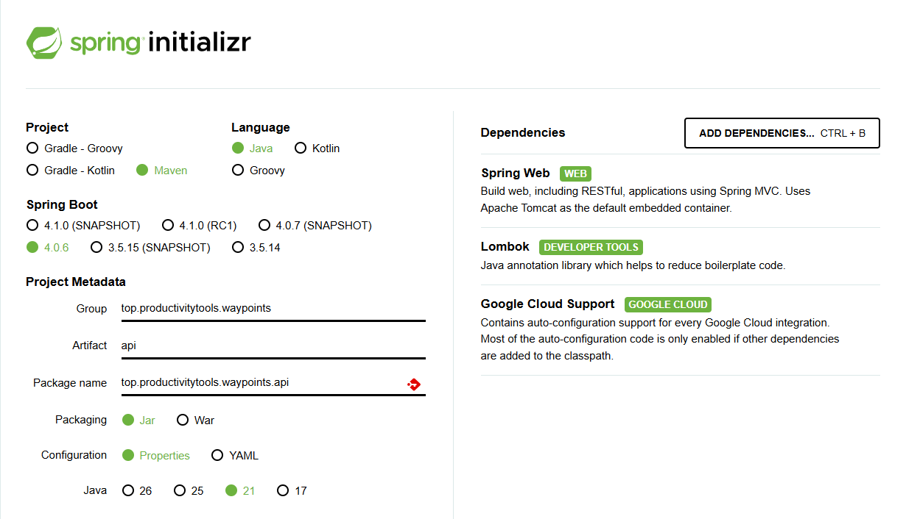

## Project initialization



Edit the `build.gradle` and add:

```gradle
implementation 'com.google.cloud:spring-cloud-gcp-starter-data-firestore'
```

## Run project
```
$env:JAVA_HOME="c:\Program Files\Java\jdk-24\"
.\gradlew.bat bootrun
```

## Graphql
Add depdencies in build.gradle
```
implementation 'org.springframework.boot:spring-boot-starter-graphql'
```
enable UI for graph ql ```application.properties```

```
spring.graphql.graphiql.enabled=true
```

## Basics
### Add home controller
```
package top.productivitytools.waypoint.api.controllers;

import org.springframework.graphql.data.method.annotation.Argument;
import org.springframework.graphql.data.method.annotation.MutationMapping;
import org.springframework.graphql.data.method.annotation.QueryMapping;
import org.springframework.stereotype.Controller;

import lombok.RequiredArgsConstructor;

@Controller
@RequiredArgsConstructor
public class HomeController {
    @QueryMapping
    public String helloQuery() {
        return "Hello World";
    }

    @MutationMapping
    public String Hello(@Argument("name") String name) {
        var response = "Hello " + name;
        return response;
    }
}

```

Add graphql

```
type Mutation{
    Hello(name: String!):String
}

type Query {
    helloQuery: String
}
```

### Testing

```
http://localhost:8080/graphiql
```
```
query {
  helloQuery
}

mutation {
  Hello(name: "Pawel")
}
```
### Deployment 

```
gcloud builds submit .
```

```
gcloud artifacts repositories create waypoints-repo --repository-format=docker --location=us-central1 --description="Docker repository for Waypoints API"
```


```
gcloud builds submit --tag us-central1-docker.pkg.dev/ptprojectsweb/waypoints-repo/api .

gcloud run deploy pt-waypoints-api --image us-central1-docker.pkg.dev/ptprojectsweb/waypoints-repo/api --platform managed --region us-central1 --allow-unauthenticated
```
delete
```
gcloud run services delete waypoints-api --region us-central1

```